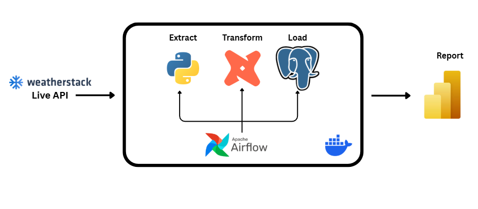
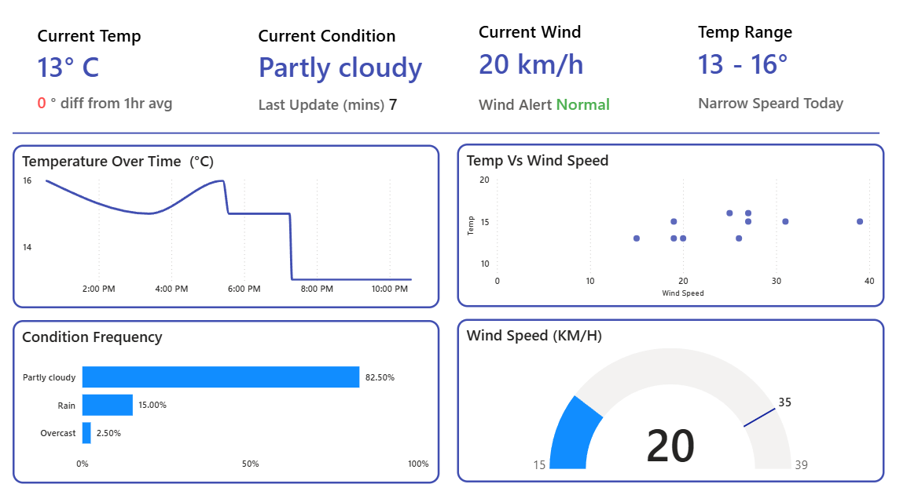

# 🌦️ Weather Data ELT Pipeline

An end-to-end ELT pipeline that ingests live weather data from the Weatherstack API, transforms it using dbt, orchestrates it with Apache Airflow, and visualizes it in a near-realtime Power BI dashboard — all containerized with Docker on WSL Ubuntu 24.

---

## 🏗️ Pipeline Architecture


*Figure 1: End-to-end ELT pipeline flow from API ingestion to dashboard*

---

## 📊 Dashboard


*Figure 2: Near-realtime Power BI dashboard using DirectQuery*

---

## 🛠️ Tech Stack

| Layer | Tool |
|---|---|
| Ingestion | Python, Weatherstack API, psycopg2 |
| Storage | PostgreSQL (Docker) |
| Transformation | dbt |
| Orchestration | Apache Airflow 3.0 |
| Visualization | Power BI (DirectQuery) |
| Infrastructure | Docker, Docker Compose, WSL Ubuntu 24 |

---

## ⚙️ Setup & Installation

### Prerequisites
- Windows with WSL Ubuntu 24
- Docker Desktop (WSL integration enabled)
- Power BI Desktop
- Weatherstack API key → [weatherstack.com](https://weatherstack.com)

### 1. Clone the repository
```bash
git clone https://github.com/YOUR_USERNAME/weather-data-project.git
cd weather-data-project
```

### 2. Configure environment variables
```bash
cp .env.example .env
```
Edit `.env` and fill in your credentials:
```
WEATHERSTACK_API_KEY=your_api_key_here
POSTGRES_USER=your_postgres_user
POSTGRES_PASSWORD=your_postgres_password
POSTGRES_DB=weather_db
```

### 3. Start all services
```bash
docker-compose up -d
```

This spins up:
- **PostgreSQL** on port `5432`
- **Apache Airflow** on port `8080`
- **dbt** container

### 4. Access Airflow
Navigate to [http://localhost:8080](http://localhost:8080) and enable the DAGs:
- `weather_ingestion_dag`
- `weather_dbt_dag`

### 5. Connect Power BI
Open Power BI Desktop → Get Data → PostgreSQL → connect using DirectQuery with your Postgres credentials.

---

## 🔄 Pipeline Flow

```
Weatherstack API
      ↓
  Python Script (psycopg2)
      ↓
  PostgreSQL (raw data)
      ↓
  dbt (transformation models)
      ↓
  PostgreSQL (analytics layer)
      ↓
  Power BI Dashboard (DirectQuery)
```

Airflow orchestrates the full pipeline, ensuring dbt runs only after a successful ingestion.

---

## 📦 Environment Variables

| Variable | Description |
|---|---|
| `WEATHERSTACK_API_KEY` | Your Weatherstack API key |
| `POSTGRES_USER` | PostgreSQL username |
| `POSTGRES_PASSWORD` | PostgreSQL password |
| `POSTGRES_DB` | Database name |
| `AIRFLOW_UID` | Airflow user ID (use `id -u` in WSL) |

---

## 🚀 DAG Overview

| DAG | Schedule | Description |
|---|---|---|
| `weather_ingestion_dag` | Every 10 mins | Fetches live data from Weatherstack API and loads into Postgres |
| `weather_dbt_dag` | Triggered | Runs dbt models after ingestion completes |
